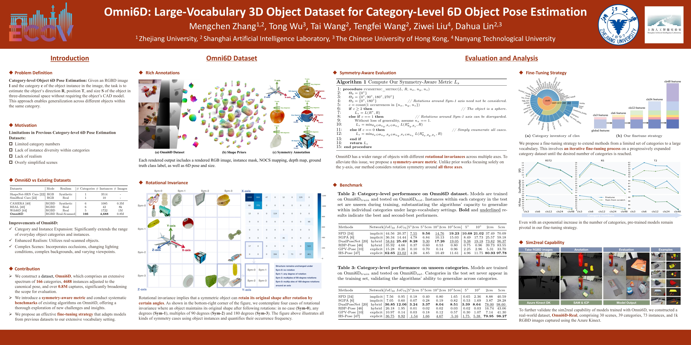

<div align="center">

# Omni6D: Large-Vocabulary 3D Object Dataset for Category-Level 6D Object Pose Estimation
<p align="center">
<a href="">"></a>
<a href="https://www.youtube.com/watch?v=BKyw51bUhZs"></a>
<a href="https://openxlab.org.cn/datasets/kszpxxzmcwww/Omni6D"></a>
</a>
</p>

<div><center>
    <a href='https://kszpxxzmc.github.io/' target='_blank'>Mengchen Zhang</a>&emsp;
    <a href='https://wutong16.github.io/' target='_blank'>Tong Wu</a>&emsp;
    <a href='https://tai-wang.github.io/' target='_blank'>Tai Wang</a>&emsp;
    <a href='https://tengfei-wang.github.io/' target='_blank'>Tengfei Wang</a>&emsp;
    <a href='https://liuziwei7.github.io/' target='_blank'>Ziwei Liu</a>&emsp;
    <a href='http://dahua.me/' target='_blank'>Dahua Lin</a>&emsp;</center>
</div>

<center><strong>Accepted to <a href='https://eccv2024.ecva.net/' target='_blank'>ECCV 2024</a>  </strong></center>

<div><center><strong><br>
    <a href='https://arxiv.org/abs/2409.18261' target='_blank'>Paper</a>&emsp;
    <a href='https://www.youtube.com/watch?v=BKyw51bUhZs' target='_blank'>Video</a>&emsp;
    <a href='https://openxlab.org.cn/datasets/kszpxxzmcwww/Omni6D' target='_blank'>Data</a>&emsp;
  </strong></center>
</div>

<br>

[](https://www.youtube.com/watch?v=BKyw51bUhZs)




</div>

## Updates
- [07/2024] Dataset **Omni6D** released!
- [09/2024] Dataset **Omni6D-xl** and **Omni6D-Real** released!

## Usage

### Download the dataset

- Sign up [here](https://sso.openxlab.org.cn/login).
- Install OpenDataLab's CLI tools through `pip install openxlab` and update it through `pip install -U openxlab`.
- View and download the dataset from the command line:

```bash
openxlab login                                                  # Login, input AK/SK
openxlab dataset info --dataset-repo kszpxxzmcwww/Omni6D        # View dataset info
openxlab dataset ls --dataset-repo kszpxxzmcwww/Omni6D	        # View a list of dataset files
openxlab dataset get --dataset-repo kszpxxzmcwww/Omni6D         # Download the whole dataset (the compressed files require approximately 388.9GB of storage)
```

If you are experiencing an error of `401: {"msg":"login required"}` with your own AKSK, please use the following AKSK:
```
AK: bmyqk5wpbaxl6x1vkzq9
SK: nl7kq9palyr6j3pwxolden7ezq4dwjmbgdm81yeo
```

You can check out the full folder structure on the website above and download a certain portion of the data by specifying the path. For example:

```bash
openxlab dataset download --dataset-repo kszpxxzmcwww/Omni6D \
                          --source-path /raw/Omni6D_V1/CAMERA/test \
                          --target-path <your-target-path>
```

For more information, please refer to the [documentation](https://openxlab.org.cn/docs/developers/%E6%95%B0%E6%8D%AE%E9%9B%86/%E6%95%B0%E6%8D%AE%E9%9B%86CLI%EF%BC%88%E5%91%BD%E4%BB%A4%E8%A1%8C%E5%B7%A5%E5%85%B7%EF%BC%89.html).

### Dataset format

```
Omni6D(-xl) // Omni6D(-xl) Dataset
├── info
│   ├── sym_info.csv 
│   │       // rotational invariance of each mesh
│   ├── <train/val/test/test_unseen>_list.txt
│   │       // valid data list of each split
├── shape_data               
│   ├── camera_<train/val/test/test_unseen>.pkl
│   │       // sampled 1024 points from each mesh, 
│   │       // normalized to NOCS
│   ├── ShapeNetCore_<2048/4096>.h5
│   ├── ShapeNetCore_unseen_<2048/4096>.h5
│   │       // sampled 2048/4096 points from each mesh
│   │       // normalized to NOCS
│   ├── mean_embedding.npy
│   │       // mean embedding of each category
│   ├── mean_points_emb.npy
│   │       // mean shape of each category
├── CAMERA         
│   ├── <train/val/test/test_unseen>
│   │   ├── <scene_id>
│   │   │   ├── <render_id>_color.png
│   │   │   │       // RGB image
│   │   │   ├── <render_id>_depth.png
│   │   │   │       // depth map
│   │   │   ├── <render_id>_coord.png
│   │   │   │       // NOCS mapping
│   │   │   ├── <render_id>_mask.png
│   │   │   │       // instance mask
│   │   │   ├── <render_id>_meta.txt
│   │   │   │       // instance name
│   │   │   ├── <render_id>_label.pkl
│   │   │   │       // ground truth annotations
Omni6D_Real // Omni6D_Real Dataset
│   ├── <scene_id>
│   │   ├── <capture_id>_color.png
│   │   │       // RGB image
│   │   ├── <capture_id>_depth.png
│   │   │       // depth map
│   │   ├── <capture_id>_mask.png
│   │   │       // instance mask
│   │   ├── <capture_id>_mask.png
│   │   │       // instance name
│   │   ├── <capture_id>_label.pkl
│   │   │       // ground truth annotations
```

## Dataset construction
1. Install a suitable version of [BlenderProc](https://github.com/DLR-RM/BlenderProc)
```
git clone git@github.com:3DTopia/Omni6D.git
cd Omni6D
pip install blenderproc 
```
2. In dataset/dataset.py, update the following:
Replace <path-to-output> with the path to your objects' data.
Replace <path-to-replica> with the path to your replica files.
3. For a single test, run the following command:
```
blenderproc run dataset/dataset.py
```
4. For batch dataset generation, execute the batch script:
```
bash multi_run.sh
```

## Benchmark
### Category-level performance on Omni6D dataset.
| Methods     | Network  | $IoU_{50}$   | $IoU_{75}$   | $5^\circ2cm$ | $5^\circ5cm$ | $10^\circ2cm$ | $10^\circ5cm$ | $5^\circ$   | $10^\circ$   | $2cm$        | $5cm$        |
| ----------- | -------- | ------------ | ------------ | ------------ | ------------ | ------------- | ------------- | ----------- | ------------ | ------------ | ------------ |
| SPD         | implicit | 44.56        | 20.37        | <u>7.55</u>  | **9.56**     | <u>14.76</u>  | **19.23**     | **10.68**   | **21.02**    | 37.49        | 70.09        |
| SGPA        | implicit | 36.34        | 14.44        | 4.78         | 6.84         | 10.13         | 15.03         | 8.49        | 17.73        | 25.57        | 59.18        |
| DualPoseNet | hybrid   | <u>58.84</u> | **25.49**    | **8.28**     | <u>9.30</u>  | **17.26**     | <u>19.05</u>  | <u>9.38</u> | <u>19.18</u> | <u>73.82</u> | <u>96.37</u> |
| RBP-Pose    | hybrid   | 35.92        | 4.66         | 0.37         | 0.60         | 0.53          | 0.80          | 0.75        | 0.96         | 39.73        | 83.55        |
| GPV-Pose    | explicit | 15.28        | 0.26         | 0.10         | 0.70         | 0.14          | 0.96          | 2.25        | 2.96         | 5.31         | 33.70        |
| HS-Pose     | explicit | **62.65**    | <u>23.02</u> | 4.26         | 4.85         | 10.49         | 11.61         | 4.96        | 11.75        | **80.93**    | **97.78**    |
### Category-level performance on Omni6D-xl dataset.
| Methods     | Network  | $IoU_{50}$ | $IoU_{75}$ | $5^\circ2cm$ | $5^\circ5cm$ | $10^\circ2cm$ | $10^\circ5cm$ | $5^\circ$ | $10^\circ$ | $2cm$ | $5cm$ |
|-------------|----------|------------|------------|--------------|--------------|---------------|---------------|-----------|------------|-------|-------|
| SPD         | implicit | 42.28	  |16.73	   |3.42          |	6.47         |	6.45      	 |12.16	         |**10.62**	     |17.71	      |21.05	|54.14|
| SGPA        | implicit | 37.62      | 12.48      | 2.45         | 5.56         | 5.12          | 10.98         | 10.25     | **17.88**      | 16.21 | 47.31 |
| DualPoseNet | hybrid   | 59.15      | 24.26      | **5.92**     | **7.24**     | **10.74**     | **13.00**     | 7.70      | 13.72      | 65.05 | 87.44 |
| RBP-Pose    | hybrid   | 41.21      | 6.55       | 0.52         | 1.63         | 0.59          | 1.74          | 3.02      | 3.20       | 23.20 | 57.27 |
| GPV-Pose    | explicit | 17.01      | 1.42       | 0.51         | 1.90         | 0.55          | 2.07          | 5.08      | 5.72       | 5.19  | 26.32 |
| HS-Pose     | explicit | **62.92**	|**26.50**	|4.98	|6.26|	8.81	|10.73	|6.65|	11.39	|**71.68**	|**89.38**|

## License
The OmniObject3D dataset is released under the [CC BY 4.0](https://creativecommons.org/licenses/by/4.0/).

## Reference
If you find our work helpful for your research, please consider giving a star ⭐ and citation 📝
```
@misc{zhang2024omni6dlargevocabulary3dobject,
      title={Omni6D: Large-Vocabulary 3D Object Dataset for Category-Level 6D Object Pose Estimation}, 
      author={Mengchen Zhang and Tong Wu and Tai Wang and Tengfei Wang and Ziwei Liu and Dahua Lin},
      year={2024},
      eprint={2409.18261},
      archivePrefix={arXiv},
      primaryClass={cs.CV},
      url={https://arxiv.org/abs/2409.18261}, 
}
```
